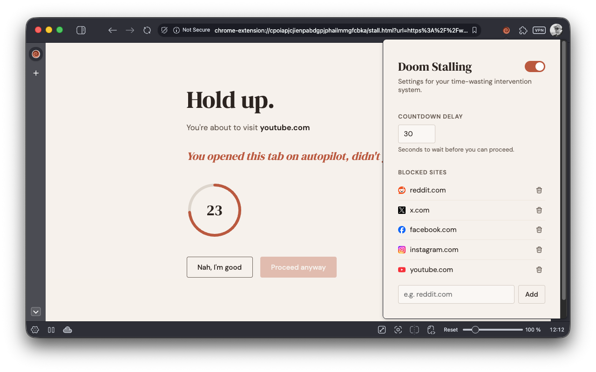

# Doom Stalling

A Chrome extension that helps you break the doomscrolling habit.

When you navigate to a time-wasting site, Doom Stalling intercepts the page and shows you a countdown screen with a pointed question — giving you a moment to reconsider whether you really want to spend your time there.

## How it works

1. Configure which sites you consider unproductive (defaults include Reddit, X, Facebook, Instagram, and TikTok)
2. Set a countdown delay (default: 30 seconds)
3. When you navigate to a blocked site, you'll see a full-page intervention with a countdown timer and a randomly chosen question prompting you to reconsider
4. Once the countdown finishes, you can choose to proceed anyway — or close the tab and do something better with your time

If you're already on the site and navigating within it, Doom Stalling won't interrupt you again. It only intervenes on fresh navigations from bookmarks, the address bar, or external links.

## Features

- Configurable site list with favicons
- Adjustable countdown delay (1–600 seconds)
- Global on/off toggle for when you need a break from the breaks
- Random motivational questions to make you think twice
- Minimal, warm design that doesn't feel like a punishment

## Installation

### From the Chrome Web Store

[Link coming soon]

### From source

1. Clone this repository
2. Open `chrome://extensions/` in Chrome
3. Enable "Developer mode" (top right)
4. Click "Load unpacked" and select the extension directory

## Permissions

- **storage**: Save your site list, delay, and enabled state
- **webNavigation**: Detect when you navigate to a blocked site

No data is collected, transmitted, or shared. Everything stays in your browser.

## License

MIT
